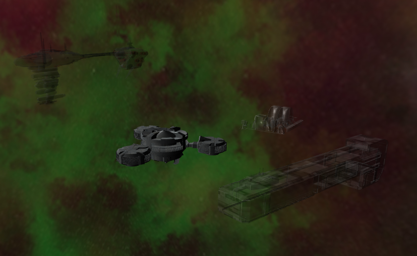
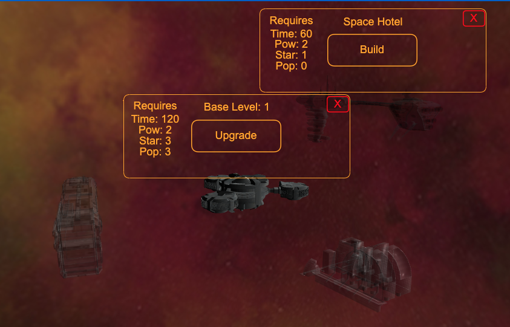
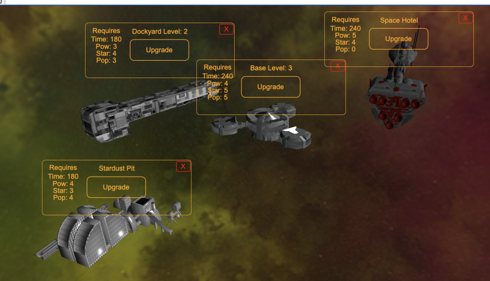
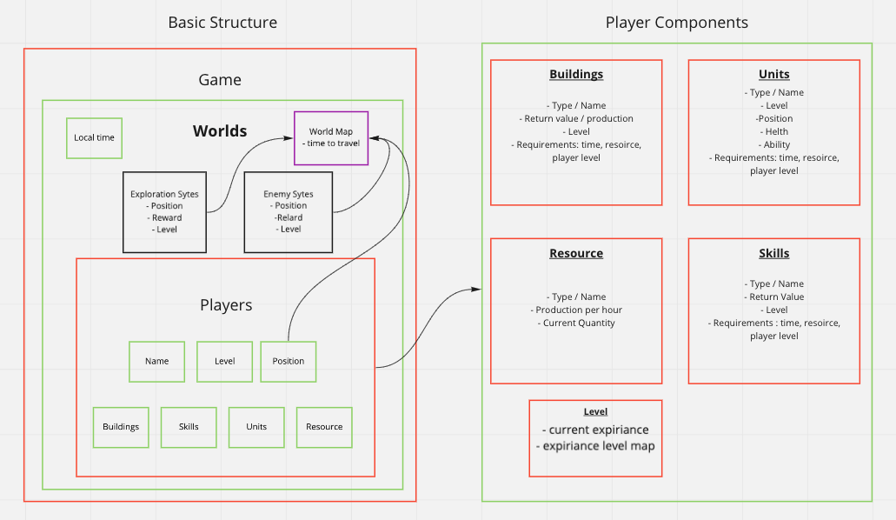
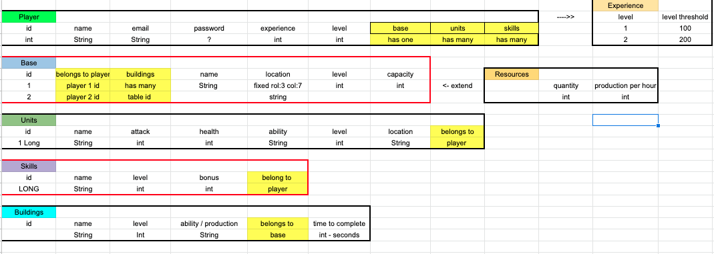
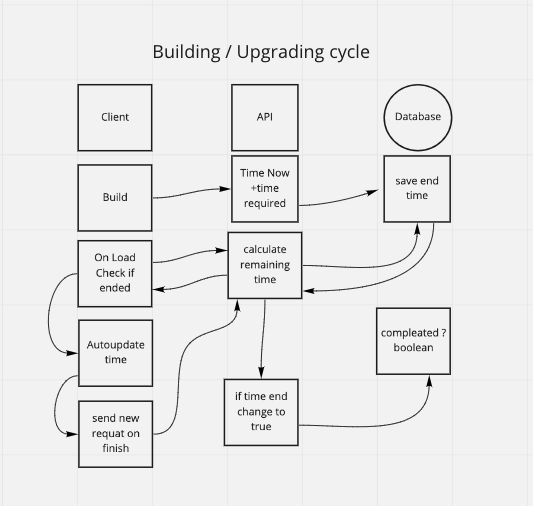

# Screenshots

<table>
<tr>
<td>

</td>
<td>

</td>
<td>

</td>
</tr>
</table>

# Requirements

- java run time env
- yarn
- postgresql

# Dev requirements to start the game

## Backend

Create a database `rtsuniverse` in postgresql an

```
$psql
postgress=#CREATE DATABASE rtsuniverse
```

update the file `Backend/src/main/resources/application.properties`

Backend first start - change the hibernate `spring.jpa.hibernate.ddl-auto` from `create-drop` to `create`. (to preserve the date in the db `update` can be used after)

```
#spring.jpa.hibernate.ddl-auto=create
#spring.jpa.hibernate.ddl-auto=create-drop
```

change the username and password for the psql

```
spring.datasource.username=iliyan
spring.datasource.password=
```

`zz
start the main function to create the db resources

check if all tables exists

```
$psql
postgress=#\c rtsuniverse
rtsuniverse=# \d
rtsuniverse=# \d players
rtsuniverse=# \d base
rtsuniverse=# \q
```

## Create the first player

send POST request to `localhost:8080/api/v1/player` with body:

```
  "email": "example@email.com",
   "name": "SomeName",
   "base": "Unreal"
```

check if the player is created Get request `http://localhost:8080/api/v1/player`

if all ok you are to run the front end;

## Frontend

```
yarn install
yarn start
```

Welcome home !


# RTS-Universe

Real time online space strategy game, based on classic 4X (Explore, Expand, Exploit, Exterminate) scenario.

# Technology Used

Java, Spring boot, Babylonjs, React, Postgresql

# MVP

- Each player has unique email - backend: :white_check_mark: frontend: :black_square_button:
- Each player has own base - :white_check_mark:
- The progress of the player is saved in real time. - :white_check_mark:
- Base have at least 3 type of resources: Power, Population, Stardust - backend: :white_check_mark: frontend: :black_square_button:
- Resources are earned hourly - backend: :white_check_mark: frontend: :black_square_button:
- Base have at least 3 buildings to be constructed - :white_check_mark:
- To construct buildings different time and resources are required. - backend: :white_check_mark: frontend: :black_square_button:
- Buildings have different abilities/production - backend: :white_check_mark: frontend: :black_square_button:
- Buildings are upgradable - backend: :white_check_mark: frontend: :black_square_button:
- For each building upgrade, player get rewards - backend: :white_check_mark: frontend: :black_square_button:
- Player can create at least 3 type of units
- Units have different abilities/use cases
- Players can earn experience.
- Each player base has unique coordinates on a map
- The player can see and explore the map
- The player can send units out of his base for exploration

# Initial Diagrams





```

```
